# Screenshots

Visual reference of the VoteChain application across different states and screens.

---

## Homepage

The landing page features a cinematic hero section with a Three.js particle network background, a "GOVERN ON-CHAIN" headline using Playfair Display, and call-to-action buttons for creating proposals and exploring existing ones.

### Dark Mode
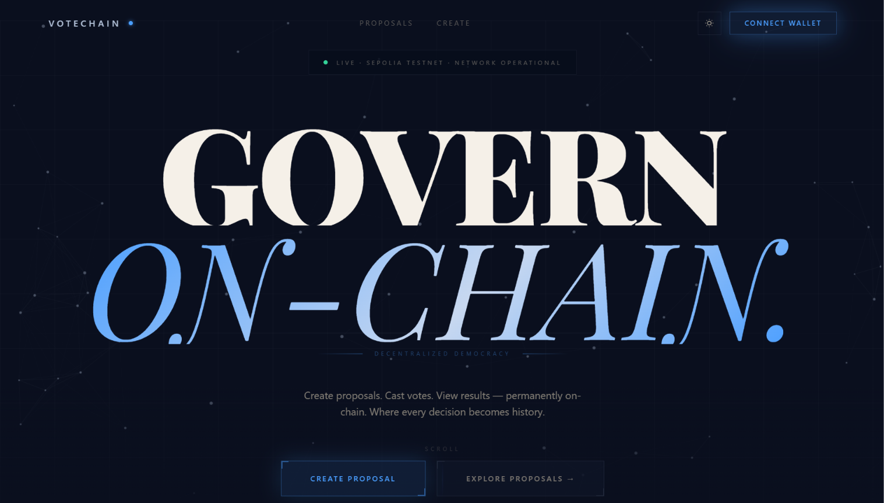

### Light Mode
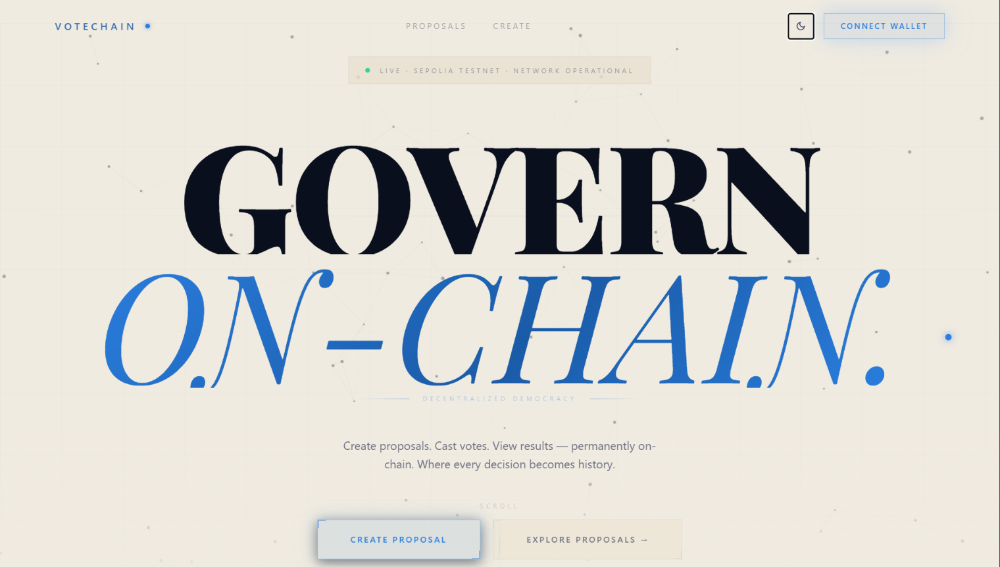

The theme toggle in the navbar switches between dark and light modes. Theme preference persists across sessions via `localStorage`.

---

## Wallet Connection

Clicking "Connect Wallet" opens the MetaMask connection prompt.

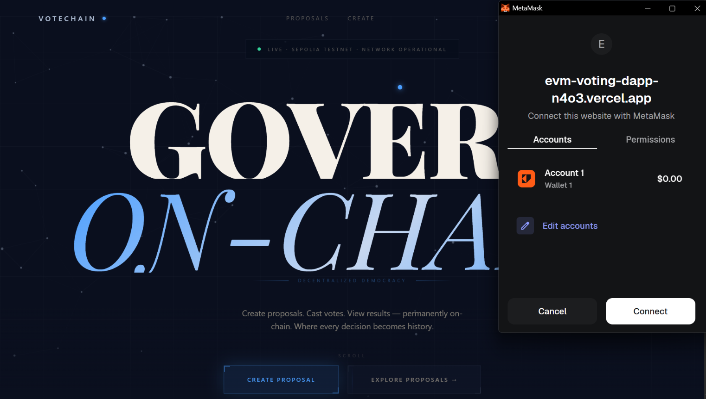

---

## Wrong Network Modal

The app only works on Sepolia testnet. If a user is connected to any other network, a blocking modal appears with a "Switch to Sepolia" button.

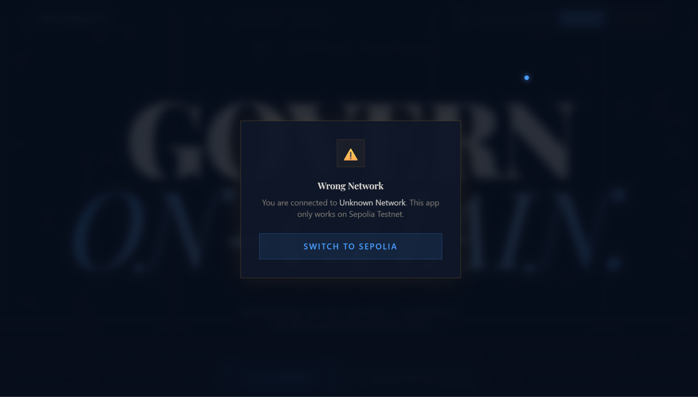

This is enforced globally by the `NetworkGuard` component in `frontend/src/components/NetworkGuard.tsx`.

---

## User Registration

New wallets must register before they can vote or create proposals. The registration form collects full name, username, email, and date of birth (18+ required).

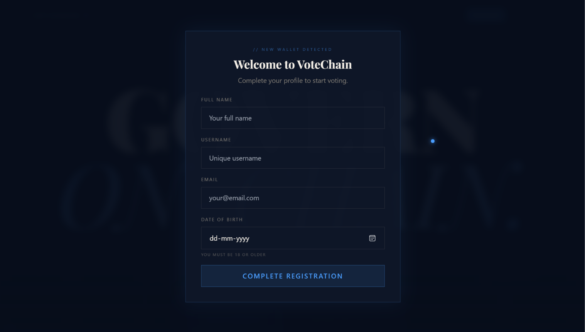

After successful registration, the backend automatically sends 0.001 Sepolia ETH to the new user's wallet from the treasury.

---

## Welcome Back Toast

Returning users see a brief toast notification confirming their identity. The toast appears for 3 seconds.

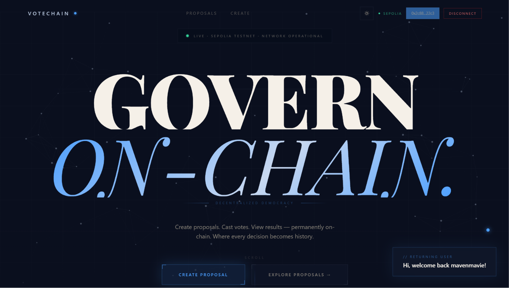

---

## Proposal List

The proposals page shows all on-chain proposals with their current vote tallies and status.

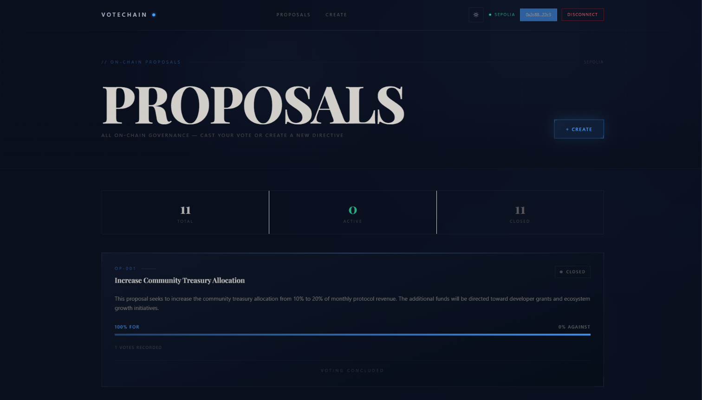

---

## Proposal Detail

Each proposal has its own detail page showing the full description, vote distribution, deadline, and voting interface.

### Top — Title, description, vote distribution
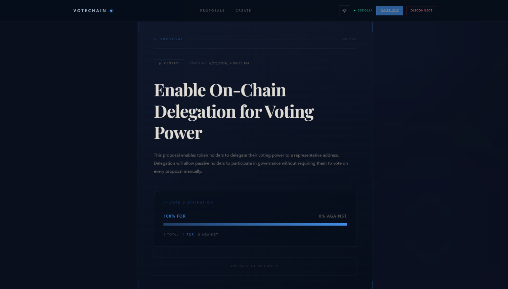

### Bottom — Vote buttons, transaction history
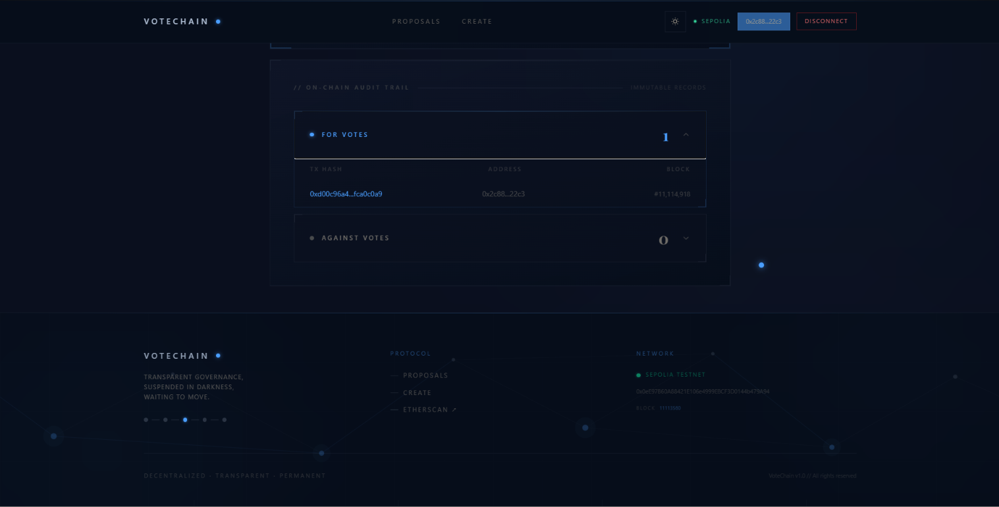

---

## Create Proposal

Authenticated users can create new proposals by providing a title, description, and voting window (1 hour, 6 hours, 24 hours, 3 days, or 7 days).

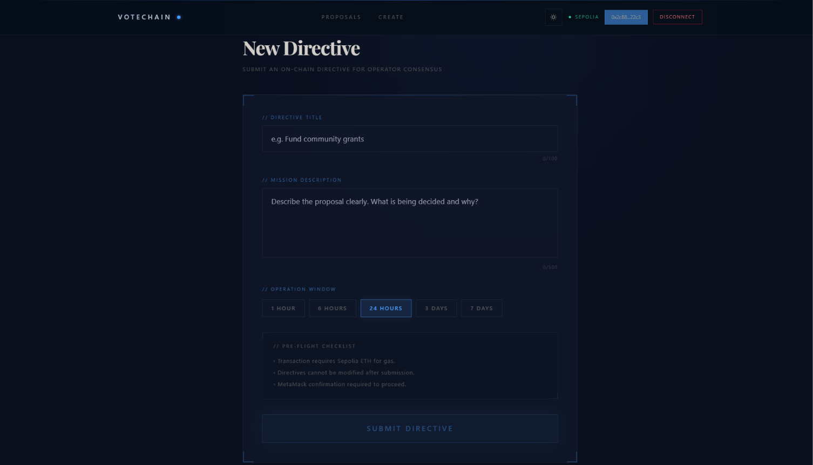

---

## Mobile View

The entire application is responsive. On mobile, the navbar collapses into a hamburger menu, the hero font scales down using `clamp(3rem, 15vw, 15rem)`, and proposal cards stack vertically.

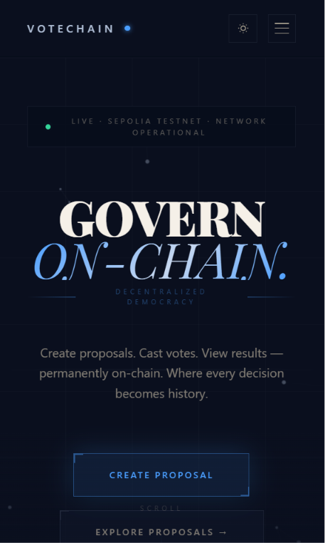

---

## Component Mapping

| Screenshot | Source files |
|-----------|--------------|
| Homepage | `frontend/src/app/page.tsx`, `frontend/src/components/ThreeHero.tsx` |
| Connect wallet | `frontend/src/components/Navbar.tsx`, `frontend/src/hooks/useWallet.ts` |
| Wrong network | `frontend/src/components/NetworkGuard.tsx` |
| Registration | `frontend/src/components/RegistrationGate.tsx` |
| Welcome back | `frontend/src/components/WelcomeBackToast.tsx` |
| Proposal list | `frontend/src/app/proposals/page.tsx`, `frontend/src/components/ProposalCard.tsx` |
| Proposal detail | `frontend/src/app/proposals/[id]/page.tsx`, `frontend/src/components/ProposalDetail.tsx` |
| Create proposal | `frontend/src/app/proposals/create/page.tsx` |
| Mobile | All components — see `Navbar.tsx` hamburger menu logic |